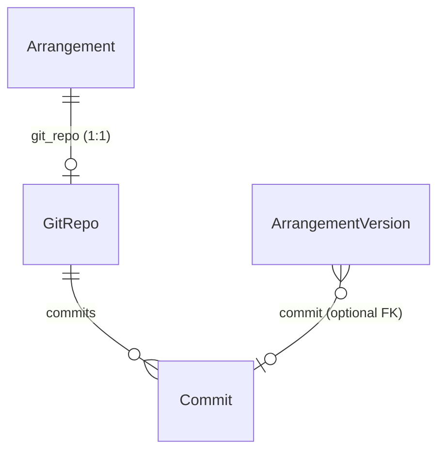

# SkuleNite-Divisi
Skule Nite Arrangement Management Website

Liam off-handedly referred to this as "Magellan but for Skule Nite" and I think that is the most perfect description ever. 

http://divisi.nbiancolin.ca

Runs inside a docker containter!

3 main apps:
- React Frontend (/frontend)
- Django Backend (/backend)
  - (& associated postgresql database)
  - And associated Celery Server

to run (dev):
```
docker-compose up --build -d
```

to run prod:
```
docker compose -f docker-compose.prod.yml up --build -d
```

Backend:
- `backend` contains django config things
- `divisi` contains everything needed to do the part-prep stuff
- `ensembles` contains everything needed for score management

## Git-per-arrangement repos (canonical history)

The Django app stores **one bare git repository per `Arrangement`** on the server filesystem. Canonical score snapshots (from ScoreForge) are committed there; the database mirrors repo metadata and links versions to commits.

### Python modules (`apps/backend/ensembles/git/`)

| Module | Role |
|--------|------|
| `paths.py` | Documents and resolves the on-disk root and per-arrangement directory names. |
| `runner.py` | Runs `git` subprocesses (`run_git`). |
| `repo.py` | Create/remove bare repos (`init_repo`, `remove_repo_files`), lightweight tags (`tag_version`). |
| `snapshots.py` | `commit_canonical_snapshot`, `GitAuthor` — clone/worktree/commit/push workflow. |
| `materialize.py` | Check out a commit and rebuild an `.mscz` for an `ArrangementVersion`. |

`ensembles.services.arrangement_git` re-exports the same API for older imports; new code should use `ensembles.git`.

### On-disk layout

All repos live under a single root directory:

```text
<ARRANGEMENT_GIT_ROOT>/
  arr_<arrangement_id>.git/    # bare repo (git init --bare), default branch main
    HEAD  config  objects/  refs/  ...
```

If `ARRANGEMENT_GIT_ROOT` is unset, Django defaults to `<BASE_DIR>/arrangement_git_repos/` (see `ensembles.git.paths.arrangement_git_root`).

### Environment / settings

- **`ARRANGEMENT_GIT_ROOT`**: preferred explicit setting (string path).
- **`DIVISI_ARRANGEMENT_REPO_ROOT`**: alternate env var (e.g. Docker Compose) — mapped in `backend.settings.base` so either name sets the same root.

Production often uses a persistent path such as `/srv/divisi-arrangement-repos/`.

### Database relationships



- **`GitRepo`**: one row per arrangement; `repo_path` is the absolute path to the bare repo directory.
- **`Commit`**: one row per recorded git commit (`sha`, parents, author, optional `tag`).
- **`ArrangementVersion.commit`**: set when the version was created from a canonical snapshot (e.g. “create from commit” or backfill). Legacy rows may use `file_name` pattern `commit-<sha>.mscz` without the FK.

Creating an `Arrangement` triggers a signal that best-effort calls `init_repo` so the bare repo exists.

### Management commands

Run inside the backend container (from `apps/backend`):

```bash
python manage.py init_arrangement_git_repos
python manage.py backfill_arrangement_git_repos --dry-run --limit 10
python manage.py backfill_arrangement_git_repos --continue-on-error
python manage.py backup_arrangement_git_repos --dry-run
python manage.py backup_arrangement_git_repos --gc
```

**Backups:** bundles are uploaded to Django `default_storage` (S3/DO Spaces or local).

- **Retention**: keep at least 7–30 days of bundles (or daily + weekly) so you can restore after disk loss or corruption.
- **Disk usage**: run `git gc` periodically (or pass `--gc` during backup) to reduce packfile bloat after backfills.
- **Restore**: download a `.bundle` and run `git clone <bundle> <new-repo-dir>` (or `git init --bare` + `git fetch <bundle> 'refs/*:refs/*'`).


## How Files storage is structured

### Part Formatter (Divisi):

- On upload action, the files are stored to `/blob/uploads/<uuid>/<file>.mscz`
- Then, the process step grabs the file from its uuid, copies it into a temp working directory, then outputs the processed file in `/blob/processed/<uuid>/<file>`
- From there, the output msc file and score pdf have the same name.

### Score Management (Ensembles)

- raw uploaded files are stored in `/blob/_ensembles/<ensemble>/<arrangement>/<version uuid>/raw/`
- Once processed, moved out of raw folder (`/blob/_ensembles/<ensemble>/<arrangement>/<version uuid>/processed/`)
- Files Exported:
  - Formatted Mscz (same file name, in root uuid folder)
  - Formatted Score (same file name, extension.pdf)
  - Raw score XML (for computing Diffs)   TODO: This should probably export with just notes and text, no other formatting at all.

> NOTE: If you log into DJANGO ADMIN then try to use the website it wont work. Clear cookies for the site then try again

# How to Contribute:

- Reach out to me (Nick) for access to the Shortcut (https://app.shortcut.com/divisi-app/epics)
- Add yourself as an owner to a ticket
- Create a new branch with your changes
- Open a PR describing your changes, and request a review from me!

The reason for doing it this way is because ** the main branch needs to ALWAYS be in a deployable state**. On every merge/commit to main, a new deploy is triggered. This is so that I / we can ship code quickly, and incrementally
